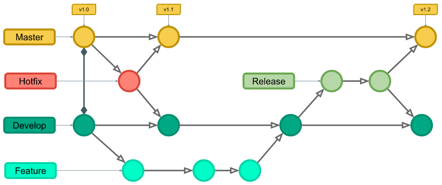

# Projeto RobocopMamonas

## 1. Introdução

Neste projeto, buscamos aplicar conceitos de programação e controle de versão, usando Git para gerenciar o desenvolvimento. O controle de versão é fundamental para manter o histórico de alterações no código e facilitar o trabalho em equipe.

## 2. Objetivos da Atividade

Os principais objetivos desta atividade foram:
- Entender e aplicar o controle de versão utilizando Git.
- Trabalhar em equipe de forma colaborativa, utilizando o GitHub como ferramenta.

## 3. Descrição da Atividade

A atividade começou com a discussão sobre as tarefas de cada membro e a organização do trabalho. Decidimos criar um robô chamado "RobocopMamonas", que possui ações programadas para buscar e atacar inimigos, desviar de balas e reagir ao colidir com paredes. O robô foi desenvolvido com uma lógica que permite buscar alvos, atirar e se movimentar conforme a posição do inimigo.

Durante o desenvolvimento, utilizamos o Git para controlar as versões do código. Criamos um repositório no GitHub, permitindo que cada integrante do grupo contribuísse e revisasse o código dos outros. Dividimos o projeto em duas branches principais: `main`, para manter o código estável, e `develop`, para implementar e testar novas funcionalidades antes de integrá-las na `main`.

## 4. Estrutura do Git Utilizada

No Git, seguimos a estrutura GitFlow para organizar nosso trabalho:

- **Repositório**: Criamos o repositório no GitHub e o organizamos com duas branches principais: `main` e `develop`.

- **Branches**:
  - `main`: Guardava a versão estável e finalizada do código.
  - `develop`: Usada para implementar e testar novas funcionalidades antes de serem aprovadas e mescladas na `main`.

- **Commits**: Fizemos commits frequentes, cada um com uma mensagem clara, para garantir que as mudanças fossem documentadas de forma compreensível. Utilizamos o padrão de mensagens de commit “Conventional Commits”, com mensagens em português. 

  - Referência: [Conventional Commits](https://www.conventionalcommits.org/en/v1.0.0/)
  - Resumo: [Padrões de Commits](https://github.com/iuricode/padroes-de-commits)

- **Feature branches**: Seguindo o padrão do GitFlow, criamos uma branch específica para cada nova funcionalidade em desenvolvimento, partindo da branch `develop`.

## 5. Resultados e Aprendizados

Essa atividade foi muito proveitosa para todos nós. Aprendemos bastante sobre como programar um robô no Robocode e também sobre como usar o Git para trabalhar em equipe. Enfrentamos alguns desafios, como ajustar a lógica de movimentação do robô e otimizar o radar, mas superamos essas dificuldades com testes e colaboração entre o grupo.

## 6. Conclusão

Em resumo, a atividade nos ajudou a entender melhor o desenvolvimento de um projeto de software de forma colaborativa. O uso do Robocode e do Git nos preparou para futuras experiências, seja em projetos acadêmicos ou profissionais, e destacou a importância do controle de versão e da comunicação clara dentro de um time.
